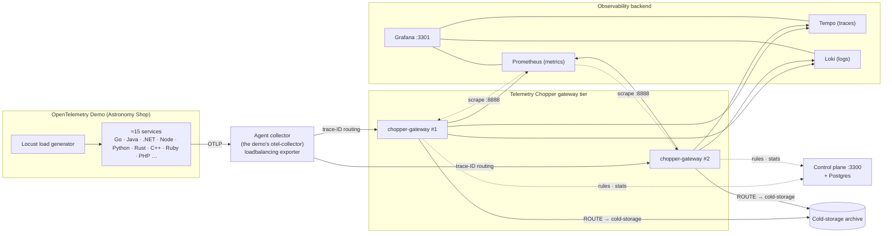

# Pilot rehearsal environment

Run Telemetry Chopper the way a pilot customer would: in front of a real microservices application, as a horizontally scaled gateway tier, shipping to a real observability backend. Use it to rehearse a pilot end to end: write the rules a customer would write, prove the savings on the vendor side, prove PII never leaves, and break things on purpose.



| Layer | What runs | Why it's production-like |
|---|---|---|
| Application | [OpenTelemetry Demo](https://opentelemetry.io/docs/demo/) 3.1.0, pinned | Real SDKs in 10+ languages, real service-to-service traces, browser spans, logs with and without trace context, infrastructure metrics |
| Agent tier | The demo's own collector, re-pointed with [`agent/otelcol-agent-extras.yaml`](agent/otelcol-agent-extras.yaml) | The standard agent → gateway topology: the `loadbalancing` exporter routes traces and logs by trace ID, so each trace lands on one gateway |
| Gateway tier | Two `chopper-gateway` replicas behind one DNS name ([`gateway/otelcol-gateway.yaml`](gateway/otelcol-gateway.yaml)) | Like a Kubernetes Deployment behind a headless Service; replicas can be killed and scaled |
| Backend | Tempo, Loki, Prometheus and Grafana | Stands in for your vendor. Its own ingest counters verify Telemetry Chopper's numbers independently. |

## Requirements

- Docker Desktop (or Docker Engine) with Compose 2.24 or later, and at least **6 GB** of memory available to Docker. The environment uses about 2.5 GB at rest.
- About 10 GB of disk for images.
- Ports `3300`, `3301`, `8180`, `9390` and `10000` free on `127.0.0.1`.

## Start and stop

```bash
deploy/pilot/scripts/up.sh
```

The first run fetches the demo at its pinned release into `deploy/pilot/.demo/`, builds the Telemetry Chopper images from your checkout, and pulls everything else. Allow a few minutes. Then open:

| | URL |
|---|---|
| Astronomy Shop | http://localhost:8180 |
| Load generator (Locust) | http://localhost:8180/loadgen/ |
| Feature flags (flagd UI) | http://localhost:8180/feature |
| Telemetry Chopper dashboard | http://localhost:3300/dashboard |
| Grafana | http://localhost:3301 (no login) |
| Prometheus | http://localhost:9390 |

In Grafana, open **Dashboards → Telemetry Chopper**:

- **Pilot overview** shows volume reduction, what the backend actually received next to what entered the gateways, application health (RED metrics computed at the agent, so sampling doesn't distort them), gateway health and log volume per service.
- **Collector Self-Monitoring** is the dashboard shipped with the Helm chart, so the rehearsal tests the real artifact.

To stop:

```bash
deploy/pilot/scripts/down.sh          # keep data
deploy/pilot/scripts/down.sh --wipe   # also delete rules, traces, logs, metrics and the archive
```

To change ports, set `CHOPPER_UI_PORT`, `GRAFANA_PORT` or `PROMETHEUS_PORT` before `up.sh`; the shop port is `ENVOY_PORT` in [`demo.env`](demo.env). To add gateway replicas:

```bash
docker compose -f deploy/pilot/compose.yaml up -d --no-build --scale chopper-gateway=3
```

## Test plan

The environment starts with **no rules**, so you measure a baseline first. Run the phases in order. Each phase lists what to do and what a pass looks like; the numbers from the reference run are under [Reference results](#reference-results).

### 1. Baseline

Let the load generator run for five minutes with no rules. In **Pilot overview**:

- **Spans/s into gateways** and **Received by Tempo** match; so do the log lines.
- **Export failures/s** is 0.
- Gateways split traffic roughly evenly (**Spans/s per gateway**).

### 2. Create the problem: raw PII

In the flags UI, set **emitRawPii** to **on**. The checkout and payment services now put `user.email`, `demo.payment.card_number` and `demo.payment.card_cvv` on their spans. (The demo's own collector-side redaction is removed in this environment, so the gateway is the only line of defense.)

In Grafana **Explore → Tempo**, run `{ span.demo.payment.card_number != nil }`. Card numbers and emails appear in full.

### 3. Apply the rules a customer would start with

Create these on the Telemetry Chopper dashboard:

| Name | Action | Signal | Condition | Extra |
|---|---|---|---|---|
| drop-static-asset-access-logs | DROP | LOGS | `log.body` REGEX_MATCH `"GET /(_next/static\|images\|icons)/` | |
| drop-flagd-evaluation-spans | DROP | TRACES | `service.name` EQUALS `flagd` | |
| sample-25pct-of-all-traces | SAMPLE | TRACES | `service.name` EXISTS | Sample rate `0.25` |
| unindex-product-found-logs | EXCLUDE_INDEX | LOGS | `log.body` EQUALS `Product Found` | |
| archive-loadgen-logs | ROUTE | LOGS | `service.name` EQUALS `load-generator` | Destination `cold-storage` |
| redact-user-email | REDACT | TRACES | `user.email` EXISTS | |
| redact-card-number-keep-last4 | REDACT | TRACES | `demo.payment.card_number` REGEX_MATCH `^\d{4}-\d{4}-\d{4}-` | |
| redact-card-cvv | REDACT | TRACES | `demo.payment.card_cvv` EXISTS | |

Within about 10 seconds, each gateway logs `ruleset updated` with `"rules_total": 8, … "rules_invalid": 0, "rules_unsupported": 0`.

### 4. Verify on the backend side

After five minutes:

- **Volume:** **Received by Tempo** ≈ spans in − spans dropped. Loki receives the logs in minus the logs dropped and the logs routed to the archive.
- **PII:** the Tempo query from phase 2 now returns `[REDACTED]` for email and CVV, and `[REDACTED_PATTERN]0454` for card numbers.
- **Trace integrity:** open a few traces in Tempo. Every span has its parent. A sampled trace is kept or dropped whole.
- **Archive:** `docker run --rm -v chopper-pilot_pilot-archive:/a busybox wc -l /a/cold.jsonl` grows.
- **Dashboard:** each rule card shows its matches, drops and savings, and the per-rule drops add up to **Telemetry dropped**.

### 5. Break things

| Test | How | Pass |
|---|---|---|
| Gateway crash | `docker kill chopper-pilot-chopper-gateway-2` | Traffic shifts to the surviving gateway within 30 s. Tempo keeps receiving. After `docker start`, traffic rebalances. |
| Control plane outage | `docker stop chopper-pilot-control-plane-1` for 90 s | Gateways keep their rules and drop rates. Traces keep flowing. Gateways log `stats report failed, counts carry over`, and the first heartbeats after `docker start` carry the backlog. |
| Traffic spike | Flags UI: **loadGeneratorFloodHomepage** on | Gateways absorb the spike with no export failures. Add a THROTTLE rule on `service.name` EQUALS `frontend-proxy` to see logs clamp. |

## Reference results

From a run on an 8-core, 16 GB laptop (Docker given 8 GB), with 10 Locust users and both gateways running. Rates are averages per second.

| Measurement | Baseline | With the eight rules |
|---|---|---|
| Spans into gateways | 83.5 | 112.4 (traffic varies) |
| Spans dropped | 0 | 77.8 (69%) → 74–79% after the sampling fix below |
| Spans received by Tempo | 83.7 | 34.8, matching in − dropped |
| Logs dropped | 0 | 9.7 of 33.5 (29%), plus 3.7/s routed to the archive |
| Gateway CPU, both replicas | 0.11 cores | 0.07 cores |
| Gateway memory, per replica | 94 MB | 81 MB (110 MB at 2× load during the flood) |
| Export failures | 0 | 0 |

| Test | Result |
|---|---|
| PII | Raw card numbers, CVVs and emails reached Tempo before the rules; afterwards every value was masked, keeping the last four card digits. |
| Gateway crash (SIGKILL) | Traffic moved to one gateway in 15–30 s, with no gap in Tempo. The agent dropped 44 of 41,766 records (0.1%), and whatever the killed gateway held in memory was lost. |
| Control plane down 90 s | Rules and drop rates unchanged throughout. Gateways' own counters showed 8,919 spans dropped and the control plane stored 9,169; the difference is where the window boundaries fall. |
| Flood (2× traffic) | 250 spans/s and 53 logs/s at 0.1 cores and 110 MB per gateway; zero export failures. |

## What this rehearsal found

These are things a pilot customer would hit. Plan for them before the pilot.

1. **A SAMPLE rule must match every span of a trace.** The first version of the sampling rule matched `service.namespace = opentelemetry-demo`. Three services don't set that attribute: the browser (`frontend-web`), nginx (`image-provider`) and the docs site. Their spans were always kept while their parents were sampled out, so **28% of traces had orphaned spans** (0% before the rule). Sampling on `service.name EXISTS` fixed it: 0 orphans. For whole-trace sampling, use a condition every span has.
2. **THROTTLE limits apply per gateway replica.** With two replicas, a 2/s limit let through 2.9/s fleet-wide: more than 2/s, but less than 4/s, because records arrive in batches and each bucket holds one second of tokens. Size the limit as *fleet limit ÷ replicas*, and expect bursty sources to pass somewhat less.
3. **Severity text varies by SDK.** The same level arrives as `INFO`, `info` and `Information`. A rule on `log.severity EQUALS INFO` misses two of them; use `REGEX_MATCH (?i)^info`.
4. **No persistent queue or memory limiter in the gateway build.** The `otelcol-chopper` distribution doesn't include `memory_limiter`, `batch` or `file_storage`. A crashed gateway loses what it held in memory, and nothing sheds load before the process runs out of memory. Production agents should keep their own retry queues (this environment's agent does).
5. **Alert on healthy replica count, not `up == 0`.** With DNS or Kubernetes service discovery, a crashed gateway disappears from Prometheus's target list instead of reporting `up = 0`, so the obvious "gateway down" alert never fires. [`backends/alerts.yml`](backends/alerts.yml) counts healthy replicas instead.
6. **Backend mapping problems look like gateway export failures.** Prometheus rejected container metrics until resource attributes were promoted to labels; Loki rejected large collector error logs until its structured-metadata limit was raised. Neither was a Telemetry Chopper problem, but both appeared as gateway export failures. Check the backend's own error before blaming the gateway.

## Troubleshooting

| Symptom | Cause and fix |
|---|---|
| Edited a config file but nothing changed | The configs are single-file bind mounts. Editors that replace the file leave the container on the old copy. Restart the container (`docker restart <name>`) rather than reloading it. |
| Agent logs `lookup chopper-gateway … no such host` at startup | The agent starts before the gateways. It retries, and the errors stop once the gateways are up. |
| `Export failures/s` is non-zero | Check the backend's logs (`docker logs chopper-pilot-prometheus-1`, `…-loki-1`) for the rejection reason. |
| A port is already in use | Change it as described under [Start and stop](#start-and-stop). |
