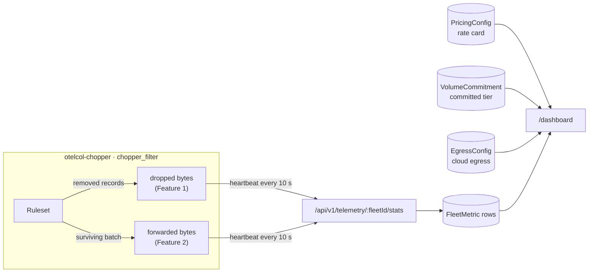

# Feature log

One page per feature added to Telemetry Chopper after the V1 launch: what it does, how to use it, how its numbers are calculated, what it changed in the data plane, API and database, and how it was verified. Start here to find out why a column, heartbeat field or dashboard card exists.

| # | Feature | Status | Pull requests |
|---|---|---|---|
| 1 | [Vendor rate cards](01-vendor-rate-cards.md): price savings on measured dropped bytes × your negotiated per-GB rates | Shipped | [#31](https://github.com/PRIYAM232/telemetry-chopper/pull/31), [#32](https://github.com/PRIYAM232/telemetry-chopper/pull/32) |
| 2 | [Overage tier modeling](02-overage-tier-model.md): track billable volume against your committed tier and price the overage penalties your rules prevent | Shipped | [#33](https://github.com/PRIYAM232/telemetry-chopper/pull/33) |
| 3 | [Split-metric pricing](03-split-ingest-indexing.md): ingest $/GB + indexing $/million events, a new EXCLUDE_INDEX action, and an ingest-vs-indexing savings breakdown | Shipped | [#35](https://github.com/PRIYAM232/telemetry-chopper/pull/35) |
| 4 | [Cloud egress savings](04-cloud-egress.md): add the cloud provider's outbound transfer fee on dropped bytes for a combined infrastructure + ingest total | Shipped | [#36](https://github.com/PRIYAM232/telemetry-chopper/pull/36) |
| 5 | [Savings time range](05-savings-time-range.md): 1h / 24h / 7d / all-time window for the savings cards, so reduction reflects the current ruleset | Shipped | [#39](https://github.com/PRIYAM232/telemetry-chopper/pull/39) |
| 6 | [Per-rule match and drop counts](06-per-rule-counts.md): which rule matched, dropped and saved what, a "no matches" warning for silent rules, and per-rule Prometheus counters | Shipped | [#40](https://github.com/PRIYAM232/telemetry-chopper/pull/40) |
| 7 | [Rule enforcement status](07-rule-enforcement-status.md): paused vs invalid vs unsupported rules in the collector log, a per-rule `rule_status` metric to alert on, and Grafana panels listing rules that aren't enforced | Shipped | [#41](https://github.com/PRIYAM232/telemetry-chopper/pull/41) |
| 8 | [Safe rule delete](08-safe-rule-delete.md): Delete asks for confirmation (with Pause as the alternative), then offers Undo; soft delete with a 60-second window | Shipped | [#42](https://github.com/PRIYAM232/telemetry-chopper/pull/42) |

## How the cost features fit together

Both features rely on the collector measuring **bytes**, not just record counts, because vendors bill ingest per GB. Every heartbeat (`POST /api/v1/telemetry/:fleetId/stats`, every 10 s) carries interval totals that the control plane stores as one `FleetMetric` row:

| Measured per signal | What it means | Used by |
|---|---|---|
| `*_dropped_bytes` | OTLP protobuf size of each span, log record or metric the ruleset removed | Feature 1 (savings), Feature 2 (volume without Chopper), Feature 4 (egress) |
| `*_forwarded_bytes` | OTLP protobuf size of each batch passed downstream, envelopes included: the volume your vendor still bills | Feature 2 (billable volume) |
| `*_unindexed` | Records forwarded with `chopper.index=false` by an EXCLUDE_INDEX rule (traces and logs) | Feature 3 (indexing savings) |
| `rules[]` | Per rule: records matched, dropped, dropped bytes and unindexed (only rules with activity) | Feature 6 (per-rule counts) |

Both are **optional** in the heartbeat. Collectors that predate them keep working, and the dashboard flags their data as unpriced or unmeasured instead of guessing.

## Adding a page

Copy the structure of an existing page (`NN-short-name.md`), add a row to the table above, and keep the sections in this order: Summary · Using it · How it's calculated · What changed (data plane, heartbeat API, database, control plane) · Upgrading and compatibility · Limitations · Verification · History.
